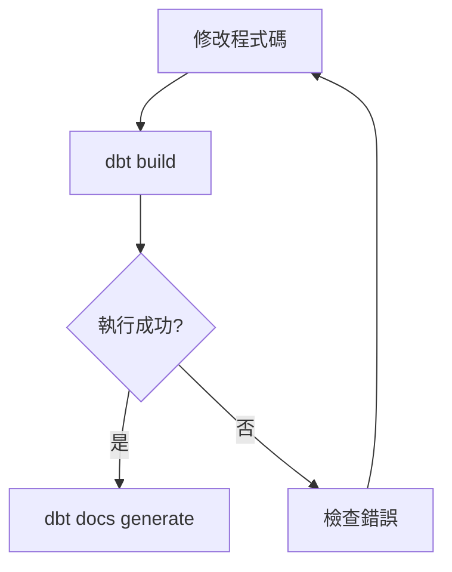
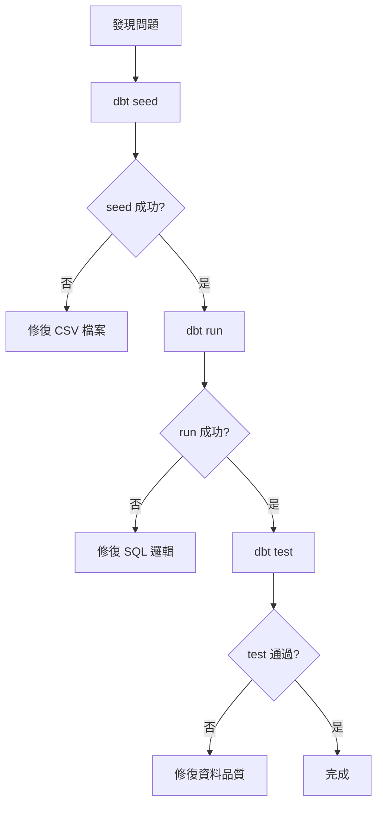
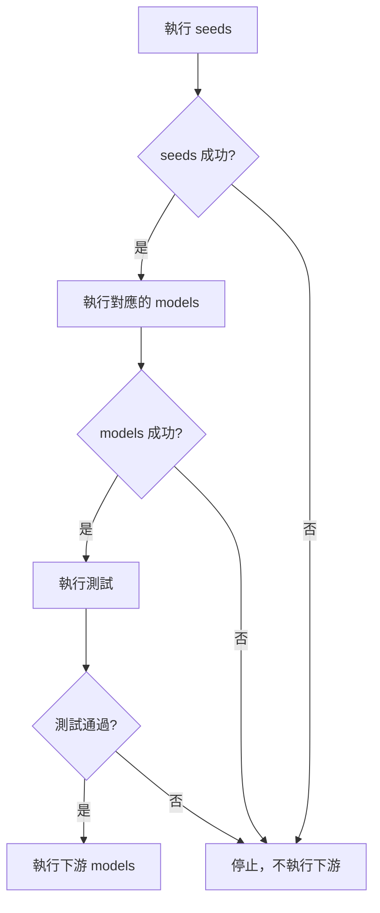

# dbt Commands 完整指令指南

## 🎯 學習目標
系統性掌握 dbt 核心指令的功能、用法和組合技巧，提升日常開發和維護的工作效率。

## 📋 大綱
1. dbt 指令概覽
2. 核心指令詳解
3. 選擇器（Selector）功能
4. 指令組合與應用場景
5. 故障排除與最佳實踐
6. 進階技巧與效率提升

---

## 1. dbt 指令概覽

### 🔧 核心指令分類

| 類別 | 指令 | 主要功能 | 常用程度 |
|------|------|----------|----------|
| **執行類** | `run` | 執行 models | ⭐⭐⭐⭐⭐ |
| **資料類** | `seed` | 載入 CSV 資料 | ⭐⭐⭐⭐ |
| **測試類** | `test` | 執行資料測試 | ⭐⭐⭐⭐⭐ |
| **整合類** | `build` | 綜合執行（推薦） | ⭐⭐⭐⭐⭐ |
| **文件類** | `docs generate` | 產生文件 | ⭐⭐⭐ |

### 🎯 實際工作中的應用關係
#### 情況一：日常開發流程

#### 情況二：分步除錯流程

---

## 2. 核心指令詳解

### 🚀 dbt run

#### 🔍 功能說明
將 dbt models 編譯成 SQL 語法，並根據設定的 materialization（view、table 等）在目標資料庫中執行。

#### 📝 基本語法
```bash
dbt run
```

#### ⚙️ 執行過程
1. **編譯 Models**：將 Jinja-SQL 轉換為純 SQL
2. **檢查依賴關係**：確認執行順序
3. **建立物件**：根據 materialization 建立 view 或 table
4. **回報結果**：顯示成功/失敗狀態

#### 💡 實際應用範例
```bash
# 執行所有 models
dbt run

# 執行特定 model
dbt run --select customers

# 只執行 staging 層 models
dbt run --select tag:staging
```

---

### 🌱 dbt seed

#### 🔍 功能說明
將 `seeds` 資料夾中的 CSV 檔案內容載入到目標資料庫中，建立為資料表。

#### 📝 基本語法
```bash
dbt seed
```

#### ⚙️ 執行過程
1. **讀取 CSV**：掃描 seeds 資料夾中的檔案
2. **建立表格**：在資料庫中建立對應表格
3. **載入資料**：將 CSV 內容插入表格

#### ⚠️ 常見問題與解決方案

**問題**：目標資料庫已存在同名表格，但欄位結構有變動
```bash
# 錯誤訊息範例
Column 'new_column' does not exist in table
```

**解決方案**：使用 `--full-refresh` 強制重建
```bash
dbt seed --full-refresh
```

#### 📊 適用場景
- **對照表維護**：狀態代碼、分類定義
- **參數設定**：業務規則、閾值
- **測試資料**：開發環境的模擬資料

---

### 🧪 dbt test

#### 🔍 功能說明
執行專案中定義的所有測試，驗證資料品質和業務邏輯。

#### 📝 基本語法
```bash
dbt test
```

#### 🎯 測試範圍
- **Generic Tests**：unique、not_null、accepted_values、relationships
- **Singular Tests**：自定義 SQL 測試
- **Schema Tests**：在 schema.yml 中定義的測試

#### 💼 實際應用範例
```bash
# 執行所有測試
dbt test

# 測試特定 model
dbt test --select customers

# 只執行 not_null 測試
dbt test --select test_type:not_null
```

---

### 🏗️ dbt build（推薦使用）

#### 🔍 功能說明
**懶人包指令**，一次性執行多個步驟的綜合指令。

#### ⚡ 執行內容
dbt build 會依序執行：
1. **seeds**：載入 CSV 資料
2. **run**：執行 models
3. **test**：執行測試
4. **snapshots**：建立快照（如有定義）

#### 🎯 核心優勢
- **智慧執行順序**：自動處理依賴關係
- **錯誤阻斷機制**：上游失敗時停止下游執行
- **資料品質保護**：測試失敗時不會污染下游資料

#### 📊 執行邏輯


#### 💡 為什麼推薦使用 build？
- **防止資料污染**：確保只有品質良好的資料進入下游
- **提升效率**：一個指令完成所有必要步驟
- **簡化流程**：減少手動執行多個指令的複雜度

---

### 📚 dbt docs generate

#### 🔍 功能說明
產生專案的技術文件，包含 models、tests、lineage 等資訊。

#### 📝 基本語法
```bash
dbt docs generate
```

#### 📄 產生的檔案內容
- **manifest.json**：包含編譯後的 SQL 語法
- **catalog.json**：資料庫欄位資訊
- **index.html**：文件網頁檔案

#### ⚡ 效能優化參數
如果不需要重新編譯，可以提升執行速度：
```bash
dbt docs generate --no-compile
```

---

## 3. 選擇器（Selector）功能

### 🎯 --select 參數的威力

#### 📝 基本語法
```bash
dbt [command] --select [selector]
# 縮寫形式
dbt [command] -s [selector]
```

### 🔍 選擇器類型詳解

#### 1. 指定特定 Model
```bash
# 只執行 customers model
dbt run --select customers
```

#### 2. 上游依賴選擇（+）
```bash
# 執行 customers 以及所有上游依賴
dbt run --select +customers
```
**應用場景**：當你修改了基礎資料，需要確保所有依賴都正確更新

#### 3. 下游影響選擇（+）
```bash
# 執行 customers 以及所有下游影響
dbt run --select customers+
```
**應用場景**：當你修改了某個 model，需要更新所有受影響的下游 models

#### 4. 完整依賴鏈選擇（+...+）
```bash
# 執行 customers 以及所有上游和下游
dbt run --select +customers+
```
**應用場景**：重大邏輯變更，需要完整驗證整個資料鏈

#### 5. 多個 Model 選擇
```bash
# 同時執行多個指定的 models
dbt run --select stg_orders stg_customers
```

#### 6. 排除特定 Model
```bash
# 執行所有 models 但排除 stg_orders
dbt build --exclude stg_orders
```

### 📋 選擇器實用範例

| 需求情境 | 指令範例 | 說明 |
|----------|----------|------|
| 只測試核心表格 | `dbt test -s customers orders` | 測試業務關鍵表格 |
| 修復上游問題後重建 | `dbt build -s +problematic_model+` | 完整重建影響鏈 |
| 快速驗證變更 | `dbt test -s modified_model+` | 測試變更影響範圍 |
| 排除問題模型 | `dbt run --exclude broken_model` | 繞過有問題的模型繼續工作 |

---

## 4. 指令組合與應用場景

### 🔄 日常開發工作流

#### 🌅 每日開始工作
```bash
# 1. 同步最新程式碼後，確保環境一致
dbt seed --full-refresh

# 2. 執行完整流程確保一切正常
dbt build
```

#### 🛠️ 開發新功能時
```bash
# 1. 開發過程中快速測試
dbt run -s my_new_model

# 2. 驗證邏輯正確性
dbt test -s my_new_model

# 3. 確保不影響下游
dbt test -s my_new_model+
```

#### 🐛 問題排查時
```bash
# 1. 先確認上游資料是否正確
dbt test -s +problematic_model

# 2. 重新執行問題模型
dbt run -s problematic_model --full-refresh

# 3. 驗證修復結果
dbt test -s problematic_model+
```

### 🚀 團隊協作場景

#### 📋 Code Review 前
```bash
# 確保所有變更都能正常執行
dbt build

# 產生最新文件供審核
dbt docs generate
```

#### 🔄 部署到正式環境前
```bash
# 完整執行並確保測試通過
dbt build

# 驗證關鍵業務邏輯
dbt test -s tag:critical
```

---

## 5. 故障排除與最佳實踐

### ❓ 常見問題與解決方案

#### Q1: dbt run 失敗怎麼辦？

**診斷步驟**：
```bash
# 1. 檢查 SQL 語法是否正確
dbt compile -s failed_model

# 2. 檢查上游依賴是否正常
dbt test -s +failed_model

# 3. 重新執行並查看詳細錯誤
dbt run -s failed_model --debug
```

#### Q2: 測試持續失敗？

**分析流程**：
```bash
# 1. 確認測試定義是否合理
dbt test -s failing_test --debug

# 2. 檢查資料品質
dbt run -s model_with_failing_test

# 3. 暫時排除問題測試繼續工作
dbt build --exclude failing_test
```

#### Q3: 執行速度太慢？

**優化策略**：
```bash
# 1. 只執行變更的部分
dbt run -s changed_models+

# 2. 並行執行（如果資料庫支援）
dbt run --threads 4

# 3. 跳過文件重新編譯
dbt docs generate --no-compile
```

### 💡 最佳實踐建議

#### 1. 指令使用策略
- **開發階段**：多用 `--select` 提升效率
- **測試階段**：使用 `dbt build` 確保完整性
- **生產環境**：優先使用 `dbt build` 保證品質

#### 2. 錯誤處理原則
- **快速失敗**：發現問題立即停止，避免錯誤擴散
- **逐步修復**：從上游到下游逐步解決問題
- **文件記錄**：記錄常見問題的解決方案

#### 3. 效率提升技巧
- **善用選擇器**：避免執行不必要的 models
- **平行處理**：合理設定 threads 數量
- **增量更新**：對大型表格使用增量策略

---

## 6. 進階技巧與效率提升

### 🎯 選擇器進階用法

#### 標籤選擇
```bash
# 執行所有標記為 daily 的 models
dbt run -s tag:daily

# 測試所有 staging 層的資料
dbt test -s tag:staging
```

#### 路徑選擇
```bash
# 執行 marts 資料夾下的所有 models
dbt run -s models/marts

# 執行特定子資料夾
dbt run -s models/staging/ecommerce
```

#### 狀態比較
```bash
# 只執行有變更的 models
dbt run -s state:modified

# 測試新增的 models
dbt test -s state:new
```

### ⚡ 效能優化技巧

#### 1. 合理使用 --threads
```bash
# 根據資料庫性能調整並行數
dbt run --threads 4
```

#### 2. 條件式執行
```bash
# 只在特定條件下執行
dbt run -s my_model --vars '{"run_expensive_models": false}'
```

#### 3. 部分重新整理
```bash
# 只重新整理特定分區
dbt run -s large_model --vars '{"start_date": "2024-01-01"}'
```

---

## 📚 延伸學習

### 🔗 相關資源
- [dbt 官方文件 - Commands](https://docs.getdbt.com/reference/commands/run)
- [Node Selection Syntax](https://docs.getdbt.com/reference/node-selection/syntax)

---

## 📋 指令速查表

### 🚀 常用指令
```bash
# 基本執行
dbt run                     # 執行所有 models
dbt seed                    # 載入所有 seeds
dbt test                    # 執行所有測試
dbt build                   # 綜合執行（推薦）

# 文件生成
dbt docs generate           # 產生文件
dbt docs generate --no-compile  # 快速產生文件

# 選擇器應用
dbt run -s model_name       # 執行特定 model
dbt run -s +model_name      # 包含上游
dbt run -s model_name+      # 包含下游
dbt run -s +model_name+     # 包含上下游
dbt build --exclude model  # 排除特定 model

# 故障排除
dbt seed --full-refresh     # 強制重建 seeds
dbt run --debug            # 顯示詳細錯誤訊息
dbt compile -s model       # 只編譯不執行
```

### ✅ 重點回顧

**核心指令掌握**：
- `dbt build` 是日常工作的最佳選擇
- `--select` 參數是效率提升的關鍵
- 錯誤排查要從上游開始逐步解決

**最佳實踐**：
- 開發時多用選擇器提升效率
- 生產環境優先使用 build 確保品質
- 善用排除功能繞過問題繼續工作

**記住**：熟練掌握 dbt 指令不只是提升工作效率，更是建立可靠資料管道的基礎！